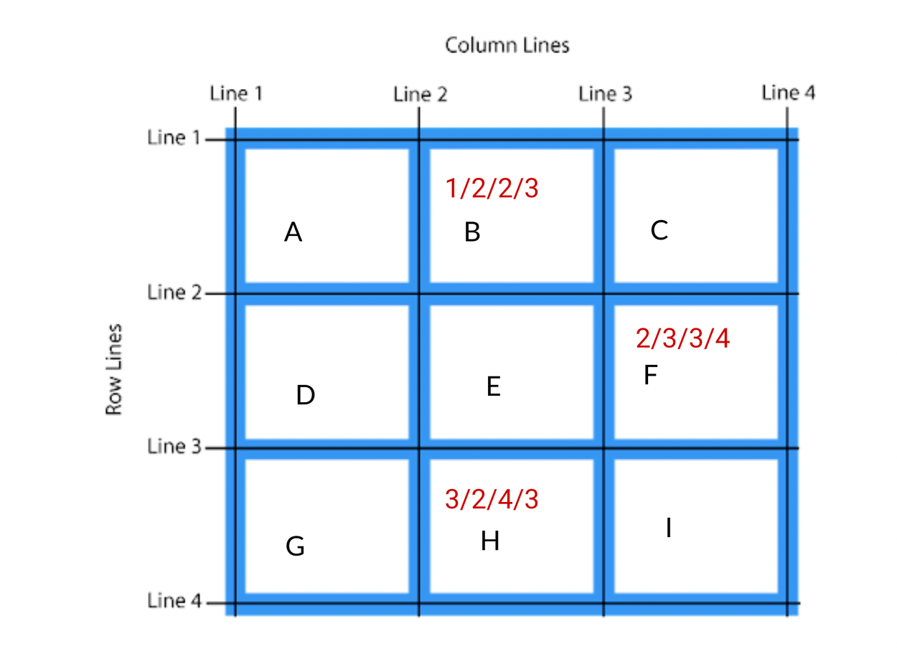
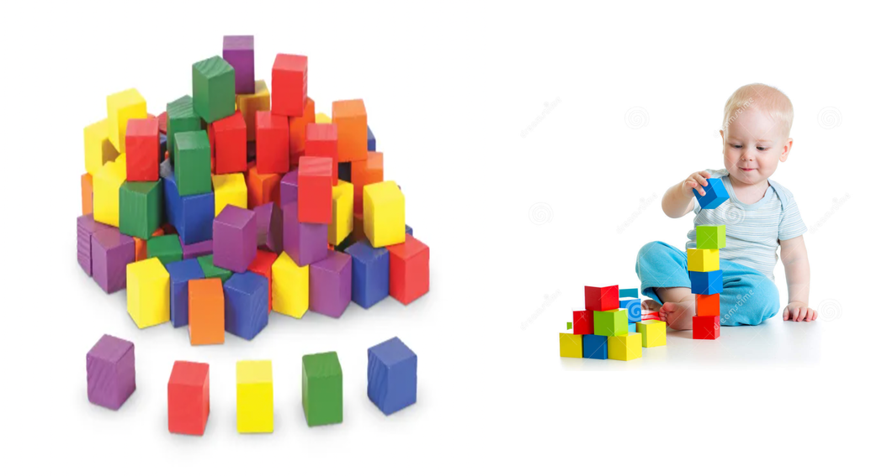

Line-based placement

- for block, B what are  these 4 values?
    - row-start-line - 1
    - column-start-line - 2
    - row-end-line - 2
    - column-end-line - 3

    


-----------
Grid-template-area method
- Since you face difficulty in line-based placement, we will now introduce to the template-area method.
- Did you play building blocks games in childhood


```
<style>
      #container {
        display: grid;
        grid-template-columns: 100px 100px 100px;
        grid-template-rows: 100px 100px 100px 100px;
        /* gap:row-gap column-gap */
        gap: 20px;
        grid-template-areas:
        "grn ylw rd"
        "mrn blu dpink"
      }

      #container > div:nth-child(1) {
        background-color: blue;
        grid-area:blu             /* label - name */
      }
      #container > div:nth-child(2) {
        background-color: green;
        grid-area:grn            /* label - name */
      }
      #container > div:nth-child(3) {
        background-color: yellow;
        grid-area:ylw
      }
      #container > div:nth-child(4) {
        background-color: red;
        grid-area:rd
      }
      #container > div:nth-child(5) {
        background-color: rgb(83, 12, 74);
        grid-area:mrn
      }
      #container > div:nth-child(6) {
        background-color: rgb(177, 52, 73);
        grid-area:dpink
      }
    </style>
  </head>
  <body>
    <div id="container">
      <div></div>
      <div></div>
      <div></div>
      <div></div>
      <div></div>
      <div></div>
    </div>
  </body>
```