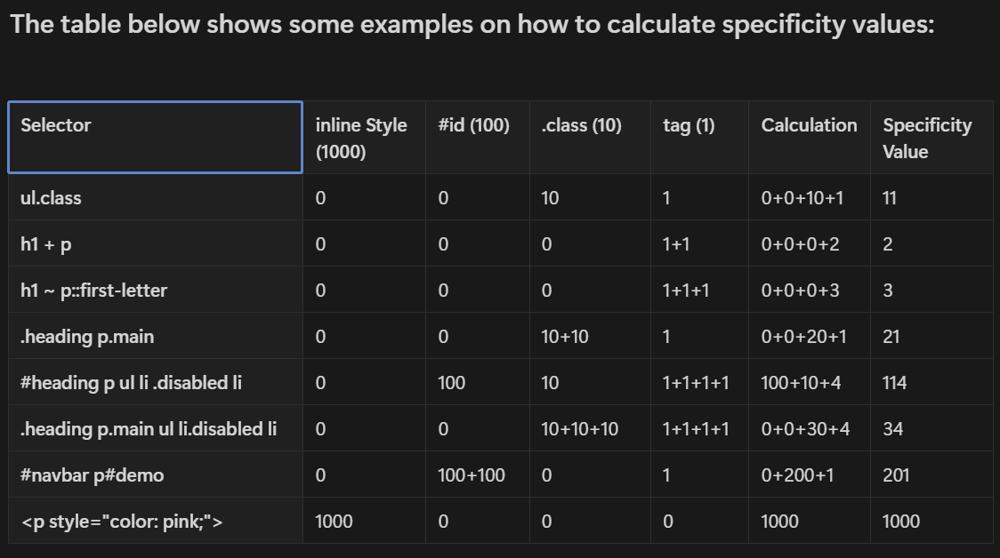

Syntax of  Media Query

- `@media` specifies media queries declaration.
- `Media type` specifies what type of media are we trying to target, In many  cases, you’ll see a `screen`value used here, which makes sense since many of the media types we’re trying to match are devices with screens attached to them. It also includes
    - `all`: Matches all devices
    - `print`: Matches documents that are viewed in a print preview or any media that breaks the content up into pages intended to print.
    - `screen`: Matches devices with a screen
- `Media Feature` defines what features we are trying to match it to.
    - Desktop: (`min-width:1024px`)
    - Tablet: `(min-width:768px)` and `(max-width:1023px)`
    - Smartphone :`(min-width:340px)` and `(max-width:767px)`
    
    


# What is Specificity?

- If there are two or more CSS rules that point to the same element, the selector with the highest specificity value will "win", and its style declaration will be applied to that HTML element.
- Think of specificity as a score/rank that determines which style declaration are ultimately applied to an element.
- Let’s take an example

```
<!DOCTYPE html>
<html lang="en">
  <head>
    <title>Document</title>
    <style>
      /* Specificity score - 100 points */
      #masai {
        background-color: teal;
      }
      /* specificity score - 1 point */
      h1 {
        background-color: red;
      }
    </style>
  </head>
  <body>
		<div>
	    <h1 id="masai">Masai school</h1>
		</div>
  </body>
</html>
```
- In the above example id has more specificity score compared to tag, so background of `teal` will be applied.
- Now, what if I use combinators to style `h1` tag

```
<style>
      /* Specificity score - 100 points */
      #masai {
        background-color: teal;
      }
      
      /* specificity score - 1 point */
      h1 {
        background-color: red;
      }

      /* specificity score - 1+1 = 2 points */
      div > h1 {
        background-color: yellow;
      }

      /* specificity score - 1+100 = 101 points */
      div > #masai {
        background-color: pink;
      }
    </style>
```
Now since div>#masai has highest specificiy score of 101, pink will be applied

