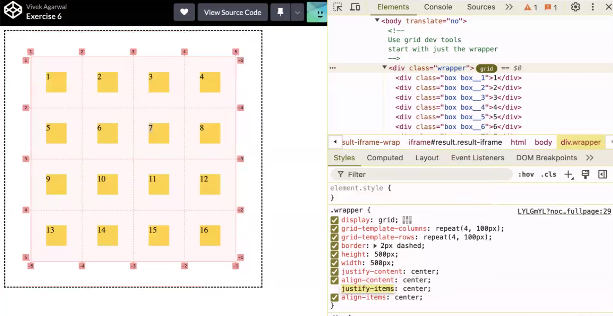
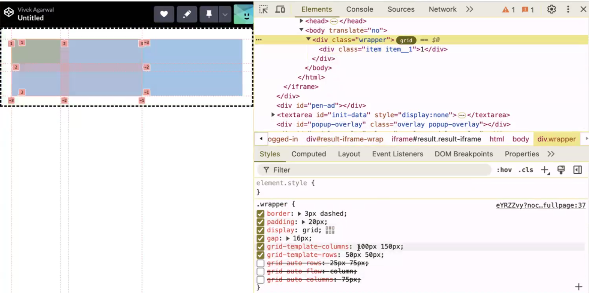
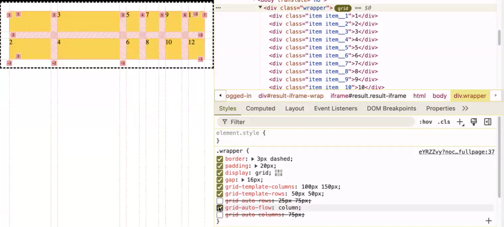

https://bead-louse-eec.notion.site/CSS-b816dde14b834056b35c3a080b8fb5e7?pvs=74

Line-based placement

- for block, B what are  these 4 values?
    - row-start-line - 1
    - column-start-line - 2
    - row-end-line - 2
    - column-end-line - 3

    


-----------
Grid-template-area method
- Since you face difficulty in line-based placement, we will now introduce to the template-area method.
- Did you play building blocks games in childhood


```
<style>
      #container {
        display: grid;
        grid-template-columns: 100px 100px 100px;
        grid-template-rows: 100px 100px 100px 100px;
        /* gap:row-gap column-gap */
        gap: 20px;
        grid-template-areas:
        "grn ylw rd"
        "mrn blu dpink"
      }

      #container > div:nth-child(1) {
        background-color: blue;
        grid-area:blu             /* label - name */
      }
      #container > div:nth-child(2) {
        background-color: green;
        grid-area:grn            /* label - name */
      }
      #container > div:nth-child(3) {
        background-color: yellow;
        grid-area:ylw
      }
      #container > div:nth-child(4) {
        background-color: red;
        grid-area:rd
      }
      #container > div:nth-child(5) {
        background-color: rgb(83, 12, 74);
        grid-area:mrn
      }
      #container > div:nth-child(6) {
        background-color: rgb(177, 52, 73);
        grid-area:dpink
      }
    </style>
  </head>
  <body>
    <div id="container">
      <div></div>
      <div></div>
      <div></div>
      <div></div>
      <div></div>
      <div></div>
    </div>
  </body>
```


<!-- ------------------------------ -->
In Grid,
theres' no concept like, main/cross instead using,
x fixed main = justify-content/justify-items
y fixed align = align-content/align-items


<br > 

----------------------
<!--autofit vs autofill vs -->
autofit
>  
- auttofit give preferenec to max like here 1ft; ..get failing while wraping only..
  - always to cover max(1fr here) first for all.
- short and simple, autofit tries to fit as much as they can on available space after satifying the first condition (150px)


<br>autofill

> 
- auttofill give preferenec to min like here 150px;
- at starting its first first priority is min 150px. 
- while growing reached 400px then divide and share accodingly (200px each)
- but once its satisfy for 450px (150px3) or more as browser gets space 3/more space AS     SOON AS it cretes 3(depends space)/more colums or according it. EVEN not have content/div/data *in reverse, aufill fit full space after dividing between them (if div/content not available)*


----------------
implicit

> 
  - if have more than four items then it applies implicit column
> 
  - just overide add  more property and boom💥
    - like, grid-auto-flow : column/rom;  
            - grid-auto-row: 60px <br>
            - grid-auto-column: 120px