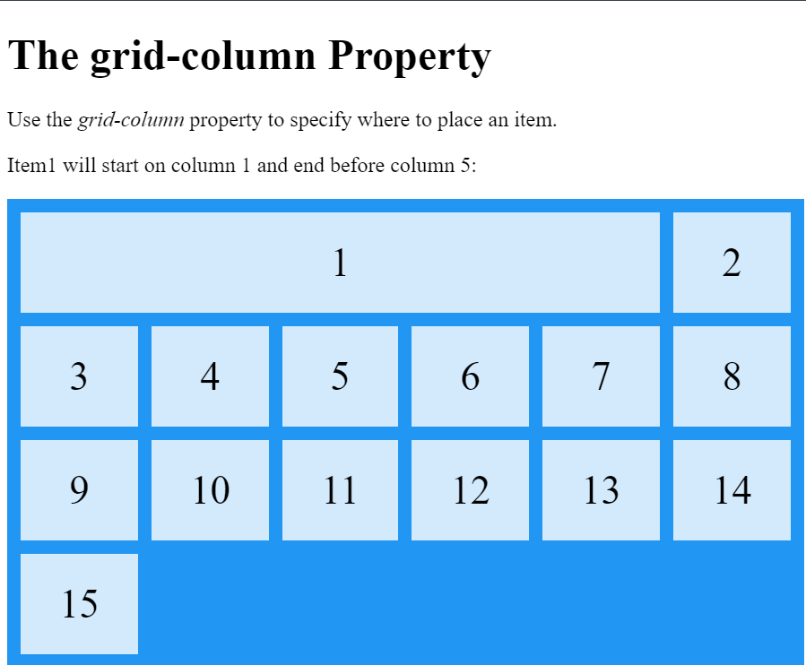
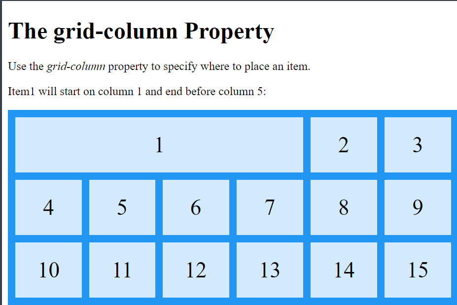

  > grid-column: 1 / span 5; //start from 1 and take span (5 box space)
  

  > grid-column: 1 / 5; //start from 1 and end before 5
  

> The grid-area Property
The grid-area property can be used as a shorthand property for the grid-row-start, grid-column-start, grid-row-end and the grid-column-end properties.

.item8 {
    grid-area: 1 / 2 / 5 / 6;
  }