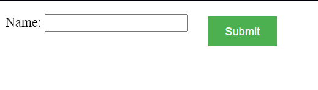

## when you wan to just move sligh change in your element like up-down-right-left that time used, relative

## when you want to make specific position with attachment that time used abosolte

https://appbrewery.github.io/css-positioning/

https://appbrewery.github.io/css-inspection/